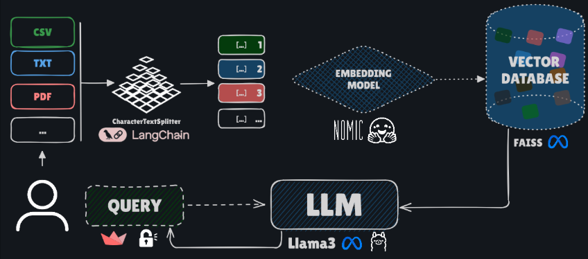

# RAGify – Chat with Your Documents, Anytime

RAGify is an intelligent retrieval-augmented chat application that lets users upload documents, ask questions about their content, and manage a personal knowledge base with persistent conversation history.

## Overview

This project implements the RAG (Retrieval-Augmented Generation) pattern to create a chatbot that answers questions based on a set of documents provided by the user. The application is fully interactive, with a web interface built in Streamlit, and includes a robust backend to manage users, conversations, and each user's vector indexes.

---

## 🔄 Application Flow

The diagram below illustrates the flow of the application, from user login to document upload, processing, and interaction with the chat.

| <center>Application Flow</center> |
|------------------|
|  |

---

## ✨ Key Features

* **User Authentication:** Account Sign Up/Login system to ensure that each user’s data is private and persistent.
* **Multi-format Upload:** Supports uploading `.pdf`, `.docx`, `.xlsx`, `.csv`, `.txt`, and `.md` files.
* **User Data Persistence:**
    * **Chat History:** Conversations are saved in a SQLite database and reloaded on each login.
    * **Knowledge Base:** Uploaded documents are converted into vectors and stored in a dedicated FAISS index for each user.
* **File Management:** Users can view and delete previously uploaded files, with the knowledge base updated accordingly.

---

## 🛠️ Technologies Used

* **[Streamlit](https://streamlit.io/)**
* **Python 3.12+**
* **LLM and RAG:** [Ollama](https://ollama.com/) with the `llama3` model and [LangChain](https://www.langchain.com/).
* **Relational Database:** [SQLite](https://www.sqlite.org/)
* **Vector Database:** [Facebook AI Similarity Search (FAISS)](https://github.com/facebookresearch/faiss)
* **Embeddings Model:** `nomic-ai/nomic-embed-text-v1` from [Hugging Face](https://huggingface.co/nomic-ai/nomic-embed-text-v1)

---

## 🚀 Installation and Setup

Follow the steps below to set up and run the project locally.

### 1. Prerequisites

* **Python 3.12 or higher:** [Download Python](https://www.python.org/downloads/)
* **Git:** To clone the repository.
* **Ollama:** The application uses Ollama to run the Llama 3 model locally.
    * [Install Ollama](https://ollama.com/).
    * After installation, pull the `llama3` model with:
        ```bash
        ollama pull llama3
        ```
    * Make sure Ollama is running before starting the Streamlit app.

### 2. Clone the Repository

```bash
git clone https://github.com/PLeonLopes/RAGify.git
cd RAGify
```

### 3. Create a Virtual Environment and Install Dependencies
```bash
# Create the virtual environment
python3 -m venv venv

# Activate the virtual environment
venv\Scripts\activate           # <- Windows

source venv/bin/activate        # <- macOS/Linux
```

Now install all dependencies with:

```bash
pip install -r requirements.txt
```

## 4. Run the Application
With the virtual environment activated, run Ollama and start the Streamlit app:

<h2> Start llama3 </h2>

```bash
ollama serve
```

<h2> Start Streamlit Application </h2>

```bash
streamlit run src/app.py
```

The application should automatically open in your default browser.

## 📖 How to Use

1. **Create an Account:** In the sidebar, enter a username and password and click "Create Account".

2. **Login:** Use the same credentials to log in.

3. **Upload Files:** In the sidebar, select one or more documents and click the "Process Files" button.

4. **Wait for Processing:** The application will extract the text, generate embeddings, and save your knowledge base.

5. **Chat:** Once the files are processed, go to the main chat area, type your question, and click "Send".

6. **Manage Your Files:** In the sidebar, you can view the list of uploaded files and remove any of them by clicking the trash icon.
